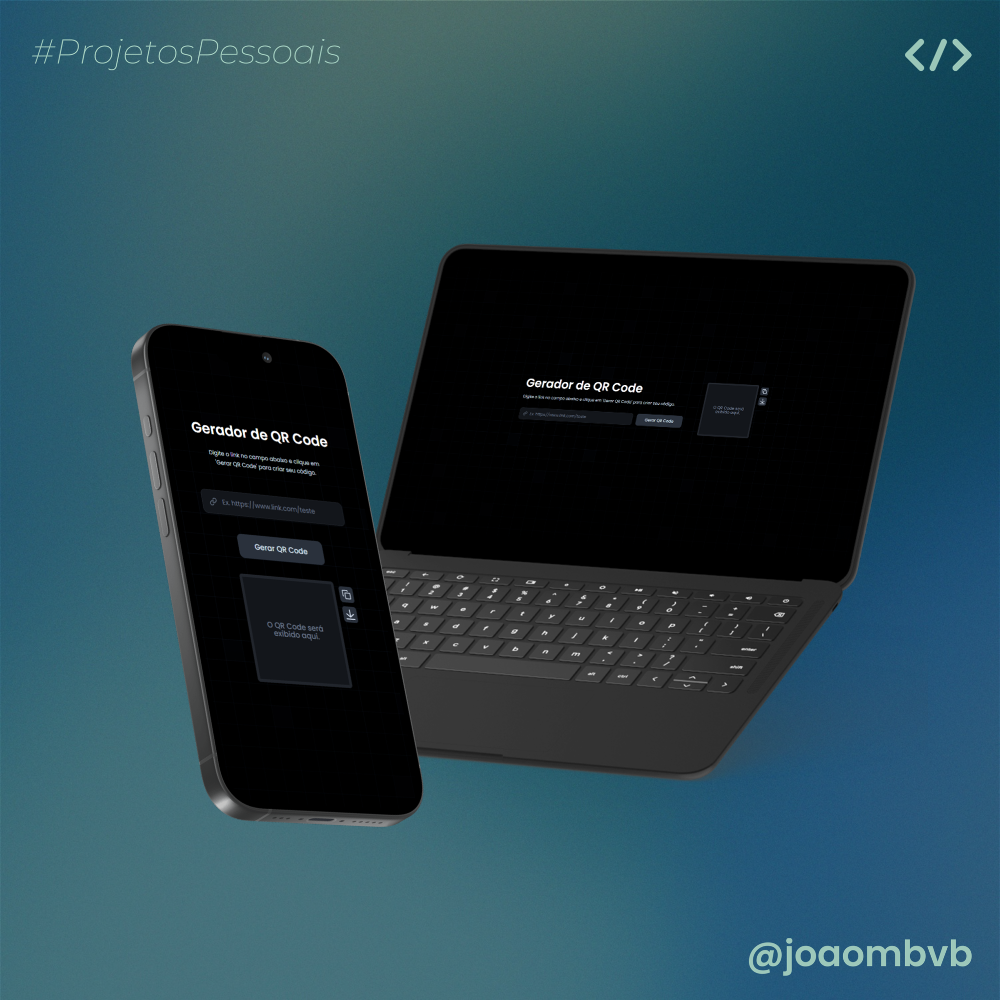

# Gerador de QR Code




## Descrição
Este é um projeto simples de Gerador de QR Code que permite ao usuário inserir um link ou texto e gerar um QR Code correspondente. O projeto é desenvolvido utilizando HTML, CSS e JavaScript.

## Funcionalidades
- Entrada de texto/link para geração do QR Code
- Botão para gerar QR Code dinâmico
- Download do QR Code gerado

## Tecnologias Utilizadas
- HTML
- CSS
- JavaScript
- Biblioteca `qrcode.js`

## Como Executar o Projeto
1. Clone este repositório:
   ```sh
   git clone https://github.com/joaombvb/QRCodeGenerator.git
   ```
2. Acesse a pasta do projeto:
   ```sh
   cd joaombvb/QRCodeGenerator
   ```
3. Abra o arquivo `index.html` em seu navegador.

4. Ou acesse o deploy: https://qrcode-joaombvb.vercel.app

## Como Usar
1. Digite o texto ou URL no campo de entrada.
2. Clique no botão "Gerar QR Code".
3. O QR Code será exibido na tela.
4. Opcionalmente, faça o download ou copie a imagem do QR Code.

## Autor
Desenvolvido por [@joaombvb](https://github.com/joaombvb).

